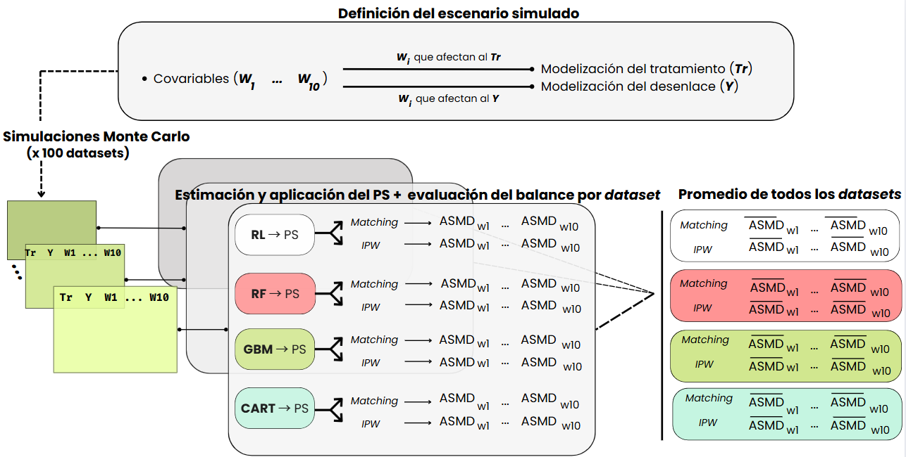

This project aims to develop my MS thesis entitled: "Comparison of tradictional models and machine learning for the estimation of propensity scores".

The basecode represents a prototype of a fully automated framework to select the best propensity score estimation method. 
Therefore, it provides a simplified implementation of the methodology to estimate propensity scores by different models (logistic regression and several machine learning methods) and evaluate balance of covariates using those estimated propensity scores.
For this purpose, it was also built to work with simulated data. 

# Introduction
In observational studies, treated and untreated (or exposed and unexposed) populations often differ in their covariates. As a result, these groups are not directly comparable. 

In the language of causal inference, this implies a violation of the ignorability assumption. Consequently, the treatment effect cannot be estimated directly from the observed outcome differences between the groups.

Propensity scores are assigned to each individual of an observational study, and reflects their probability of receiving treatment based on their covariates.
Traditionally, propensity scores have been estimated using logistic regression. However, new approaches have 

# Instructions

## Installation of packages

This project provides a `renv` environment. Make sure to have `renv` installed and execute the following command to install all the necessary packages:

```r
renv::restore()
```

## Scripts / Pipeline

* `functions.R` contains all designed functions for the analysis. User can modify simulated scenarios (i.e.: covariates, modeling of outcome/treatment, etc.) and other features of the analysis (incorporating another ML method, testing other hyperparameters, etc.).
* `simulation.R` small script to produce Monte Carlo simulations of all scenarios. Generates `all_scenarios.rda`, a list in which elements refers to an scenario, and contains datasets from which all analysis are made.
* `analysis.R` runs the entire analysis. All the results are stored in `results` folder.
* `plots.R` script to perform all the plots.


# Methodology

Three simulated scenarios of increasing complexity (A, B, and C) were created based on the design by Pirracchio et al. (2018). [2] Each scenario includes:

* One binary treatment variable (Tr)
* One continuous outcome (Y)
* Ten covariates (W1–W10), including linear (W1–W6), non-linear transformations (W7, W8), and interaction terms (W9, W10).

Propensity scores were estimated using:

* Logistic Regression (baseline)
* Random Forest (RF)
* Gradient Boosting Machines (GBM)
* Classification and Regression Trees (CART)

Covariate balance was assessed using:

* Nearest-neighbor matching
* Inverse Probability Weighting (IPW)

Balance was quantified using:

Absolute Standardized Mean Differences (ASMD) for each covariate

Average ASMD (ASAM) across all confounders



⚙️ Hyperparameter Tuning

The methodology is strongly inspired from the study of Cannas & Arpino [3], prioritizing covariate balance over prediction accuracy during hyperparameter tuning.

For further details consult the original thesis `TFM_Cristina_Juarez_Alia.pdf` (in Spanish).

# Bibliography

1. **Setoguchi, S.**, Schneeweiss, S., Brookhart, M. A., Glynn, R. J., & Cook, E. F. (2008). *Evaluating uses of data mining techniques in propensity score estimation: a simulation study*.  _Pharmacoepidemiology and Drug Safety_, **17**(6), 546–555. [https://doi.org/10.1002/pds.1555](https://doi.org/10.1002/pds.1555)

2. **Lee, B. K.**, Lessler, J., & Stuart, E. A. (2010). *Improving propensity score weighting using machine learning*. _Statistics in Medicine_, **29**(3), 337–346. [https://doi.org/10.1002/sim.3782](https://doi.org/10.1002/sim.3782)

3. **Cannas, M.**, & Arpino, B. (2019). *Tuning parameters in propensity score estimation: A simulation study assessing performance of balance, overlap, and treatment effect*. _Computational Statistics & Data Analysis_, **131**, 1–13. [https://doi.org/10.1016/j.csda.2018.10.005](https://doi.org/10.1016/j.csda.2018.10.005)
