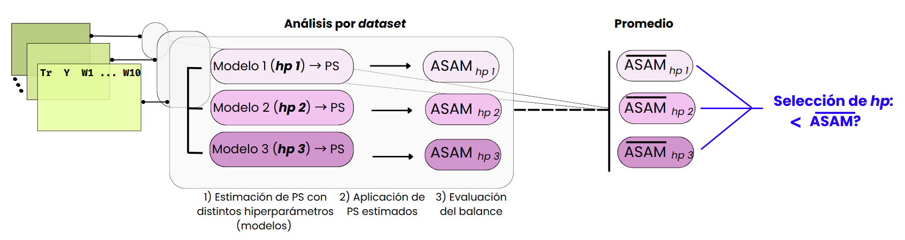

This project is based on my Master's thesis entitled: "Comparison of Traditional Models and Machine Learning for the Estimation of Propensity Scores."

The repository contains a prototype of a fully automated framework designed to select the best method for estimating propensity scores. It provides a simplified implementation of the methodology for estimating PS using different models (logistic regression and several machine learning algorithms), and for evaluating covariate balance based on the estimated scores. The implementation is tailored to simulated datasets—where treatment assignment and outcome are modeled from specified covariates, but can be adapted to work with real-world data.

# Introduction

In observational studies, treated and untreated (or exposed and unexposed) populations often differ in their covariates. As a result, these groups are not directly comparable. In the language of causal inference, this implies a violation of the ignorability assumption. Consequently, the treatment effect cannot be estimated directly from the observed outcome differences between the groups.

The use of **propensity scores (PS)** allows researchers to balance these covariates, making treated and untreated groups comparable, and enabling an unbiased estimation of the causal effect. PS are assigned to each individual in a study and reflect their probability of receiving treatment based on their observed covariates. Traditionally, PS have been estimated using **logistic regression**, due to its simplicity and interpretability. However, new approaches based on **machine learning (ML)** have emerged, offering several advantages: they do not rely on strong parametric assumptions and can automatically capture non-linear relationships and interactions among covariates that are often omitted in standard regression models.

This project explores whether ML methods; specifically, Random Forest (RF), Gradient Boosting Machines (GBM), and Classification and Regression Trees (CART); can outperform logistic regression in estimating propensity scores and achieving better covariate balance. The study uses simulated data under controlled conditions to compare the performance of these methods using established metrics such as ASMD and ASAM.

# Instructions

## Installation of packages

This project provides a `renv` environment. Make sure to have `renv` installed and execute the following command to install all the necessary packages:

```r
renv::restore()
```

## Scripts / Pipeline

* `functions.R` contains all designed functions for the analysis. User can modify simulated scenarios (i.e.: covariates, modeling of outcome/treatment, etc.) and other features of the analysis (incorporating another ML method, testing other hyperparameters, etc.).
* `simulation.R` small script to produce Monte Carlo simulations of all scenarios. Generates `all_scenarios.rda`, a list in which elements refers to an scenario, and contains datasets from which all analysis are made.
* `analysis.R` runs the entire analysis. All the results are stored in `results` folder.
* `plots.R` script to perform all the plots.

# Methodology

Three simulated scenarios of increasing complexity (A, B, and C) were created based on the design by Pirracchio et al. (2018). [2] Each scenario includes:

* One binary treatment variable (Tr)
* One continuous outcome (Y)
* Ten covariates (W1–W10), including linear (W1–W6), non-linear transformations (W7, W8), and interaction terms (W9, W10).

Propensity scores were estimated using:

* Logistic Regression (baseline)
* Random Forest (RF)
* Gradient Boosting Machines (GBM)
* Classification and Regression Trees (CART)

Covariate balance was assessed using:

* Nearest-neighbor matching
* Inverse Probability Weighting (IPW)

Balance was quantified using:

Absolute Standardized Mean Differences (ASMD) for each covariate

Average ASMD (ASAM) across all confounders


This project adopts the strategy proposed by Cannas & Arpino [19], which prioritizes covariate balance over predictive performance when tuning hyperparameters. Specifically, optimal hyperparameters are selected based on the evaluation of global covariate balance, measured using ASAM, rather than traditional predictive metrics such as accuracy.

In brief, multiple models are trained with different hyperparameter configurations. For each model, PS are estimated and applied using both IPW and nearest-neighbor matching. The resulting covariate balance is then assessed via ASAM. The optimal hyperparameter is the one that yields the lowest ASAM, indicating better balance between treated and untreated groups.



Note: Only one hyperparameter per machine learning method was tuned to reduce computational cost:

* `mtry` for Random Forest

* `shrinkage` for GBM

* `cp` for CART

This is an acknowledged limitation of the study, as a more exhaustive search (e.g. tuning multiple parameters simultaneously) might lead to better results. However, this trade-off was necessary to keep the workflow manageable and reproducible, as it was built for academic purposes.

📚 For full details, see the original thesis in this repository: TFM_Cristina_Juarez_Alia.pdf (in Spanish)

# Bibliography

1. **Setoguchi, S.**, Schneeweiss, S., Brookhart, M. A., Glynn, R. J., & Cook, E. F. (2008). *Evaluating uses of data mining techniques in propensity score estimation: a simulation study*.  _Pharmacoepidemiology and Drug Safety_, **17**(6), 546–555. [https://doi.org/10.1002/pds.1555](https://doi.org/10.1002/pds.1555)

2. **Lee, B. K.**, Lessler, J., & Stuart, E. A. (2010). *Improving propensity score weighting using machine learning*. _Statistics in Medicine_, **29**(3), 337–346. [https://doi.org/10.1002/sim.3782](https://doi.org/10.1002/sim.3782)

3. **Cannas, M.**, & Arpino, B. (2019). *Tuning parameters in propensity score estimation: A simulation study assessing performance of balance, overlap, and treatment effect*. _Computational Statistics & Data Analysis_, **131**, 1–13. [https://doi.org/10.1016/j.csda.2018.10.005](https://doi.org/10.1016/j.csda.2018.10.005)
